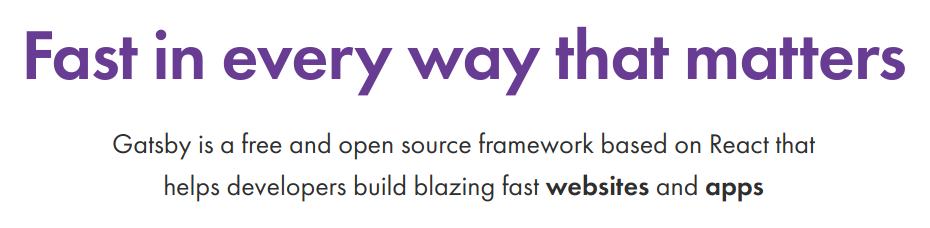

웹개발을 배울 때부터 두고두고 블로그를 만들자.. 라는 생각을 한지도 몇개월이 흘렀습니다.

처음에 `create-react-app`으로 시작해 이것저것 손보면서 만들어 보기도 했었습니다. 생각보다 신경쓸게 많더라구요. 다른 프로젝트를 이것저것 손대며 시간을 보내던 와중에 갑자기🤩(?) 블로그 프레임워크를 검색해서 알아봤습니다.

- - -

## Jekyll

가장 눈에 먼저 들어온건 [Jekyll](https://jekyllrb.com/)이었습니다. 많은 분들이 Jekyll로 블로그를 만드시고도 했고, 몇몇 회사 스택으로도 있어서 이름이 익숙했습니다.

Jekyll은 Ruby언어로 제작한다고 알고 있습니다. Ruby를 사용해본적이 한번도 없었기 때문에 튜토리얼 영상을 보면서 하루정도 사용해보았습니다.

<iframe width="560" height="315" src="https://www.youtube.com/embed/T1itpPvFWHI" frameborder="0" allow="accelerometer; autoplay; encrypted-media; gyroscope; picture-in-picture" allowfullscreen></iframe>

 

이미 만들어진 템플릿도 꽤 있고, Ruby 언어를 조금만 공부한다면 간단한 블로그를 만들기에는 쉬워보입니다.

- - -

## Hexo

[Hexo](https://hexo.io/ko/docs/index.html)는 Node.js를 사용하는 블로그 프레임워크입니다.

<iframe width="560" height="315" src="https://www.youtube.com/embed/Kt7u5kr_P5o" frameborder="0" allow="accelerometer; autoplay; encrypted-media; gyroscope; picture-in-picture" allowfullscreen></iframe>

 

Ruby 튜토리얼 하신분이 블로그 프레임워크를 주제로 영상을 많이 찍으시나 봅니다. 같은분이시네요.

Hexo는 사용하지 않아서 잘은 모르겠습니다만, 공식문서가 한글화가 나름 잘 되어 있는걸 보니 쉽게 접근할 수 있을 것 같습니다. Node.js를 사용하기 때문에 Javascript 단일 스택으로도 무난해 보이구요.

- - -

## Gatsby

찾다 찾다가 [Gatsby](https://www.gatsbyjs.org/)가 핫하다는 블로그 글을 몇개 보게 됐습니다. Jekyll이나 Hexo도 좋아 보이지만, Gatsby는 React에 기반해 만든다는 점이 굉장히 마음에 들었습니다. React를 주로 쓰고 있었기 때문에 활용할 수 있으면 정말 금상첨화겠죠. 거기다 GraphQL도 어느정도 익숙했기 때문에 바로 이거다! 하고 Gatsby를 블로그 개발에 사용하기로 했습니다.

> _초고속으로 만들수 있습니다!🤣_

무엇보다 조금 놀랐던건, 제가 Gatsby를 공부하면서 사용법에 아직 익숙하지 않아 고민을 좀 하고 있던 다음날, Udemy에서 강의를 몇개 들었던 강사분이 갑자기 Gatsby BootCamp를 유튜브에서 무료료 푸셔서 여기서 도움을 많이 받아 조금은 수월하게 진행할 수 있었습니다. 정말 기막힌 타이밍이었습니다.👏

<iframe width="560" height="315" src="https://www.youtube.com/embed/8t0vNu2fCCM" frameborder="0" allow="accelerometer; autoplay; encrypted-media; gyroscope; picture-in-picture" allowfullscreen></iframe>

 

강의의 질도 상당히 좋았습니다. 전 이분 특유의 깔끔한 목소리가 좋더라구요.
함께 간단한 블로그를 만들면서 사용법을 익히시면 많은 도움이 될거라고 생각합니다.

다음 포스팅부터 개츠비를 이용해 블로그를 만든 경험을 좀 더 상세히 적어볼 계획입니다. 이 글을 쓰고있는 당시는 아직 블로그 전체적인 구성이 완성되지 않아 아직은 시간이 그렇게 많지 않군요.👻

아무튼 개발 도중이긴 하지만, React를 사용하시면서, 블로그 또는 단순한 정적 사이트를 만드려고 고민하시는 분들에게 Gatsby는 좋은 선택인 것 같습니다.👍