> _Udemy 강의를 듣고 직접 정리한 요약본입니다._

같은 함수의 여러가지 구현을 생각해볼 때, 어떤것이 **최고**라고 할 수 있을까?

### Who Cares?

- 우리의 코드가 성능이 어느정도 되는지 표현 할 수 있는 정확한 단어가 있는것은 중요하다.
- 서로 다른 접근법의 모순을 이야기하는데 유용함
- 우리의 코드가 느려지거나 크래쉬났을때, 코드의 비효율적인 부분을 찾아내는것은 우리 앱의 고통을 덜어줄 수 있다.
- 별로 안중요함 : 인터뷰에 나온다!

### 예제 : 1부터 n까지 더하는 함수를 가정해보자

```javascript
// for loop 이용
function addUpTo(n) {
  let total = 0;
  for (let i = 1; i <= n; i++) {
    total += i;
  }
  return total;
}

//흐른 시간
//1: 1.365799999970477 초
//2: 1.1890000000130385 초
```

```javascript
//수학 공식 이용
function addUpTo(n) {
  return (n * (n + 1)) / 2;
}

//흐른 시간
// 1 : 0.00010000000474974513 초
// 2 : 0.00010000000474974513 초
```

```javascript
var t1 = performance.now()
addUpTo(1000000000); //
var t2 = performance.now();
console.log(`흐른 시간: ${(t2 - t1)/1000} 초`)
```

### '좋다'의 의미는?

1. 빠른가 ?

2. 적은 메모리 집약? (less memory-intensive)

3. 더 나은 가독성 ?

모두다 맞는 말이지만, 1,2 번이 주로 언급하는 문제이고, 1번이 주라고 생각한다.

### 시간을 측정하면서의 문제점

- 서로다른 머신은 서로다른 시간을 기록한다
- 같은 머신 또한 서로다른 시간을 기록한다!
- 매우 빠른 알고리즘에서 속도측정은 충분히 정확하지 않을 수 있다?

### 시간을 사용하지 않는다면 뭐로 측정하나?

매우 변수적인*초(second)*를 카운팅하는것 보다 ⇒ 컴퓨터가 수행하는 간단한 **연산자의 갯수**를 카운팅하자!

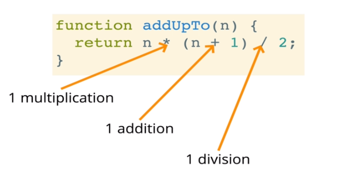

- n의 크기에 관계없이 '3'의 간단한 연산

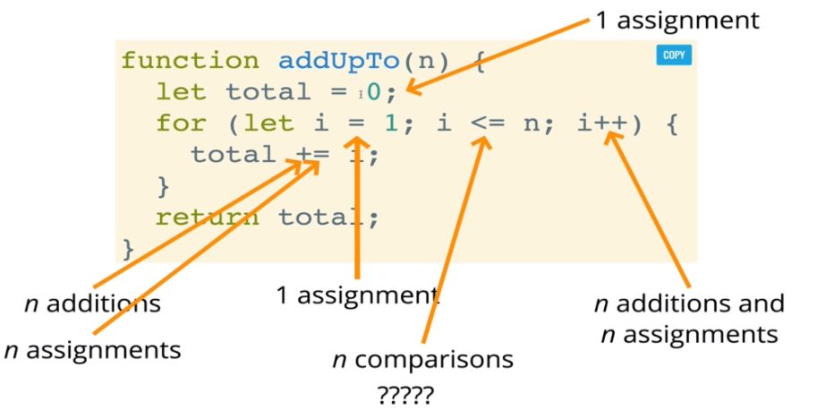

- 우리가 무엇을 세는지에 따라서 연산자의 갯수는 2n보다 작거나,  5n+2보다 클 수 있다.
- 그러나 정확한 갯수에 상관없이, 연산자의 갯수가 증가함에 따라 **n에 비례해서 급격하게 증가**한다.

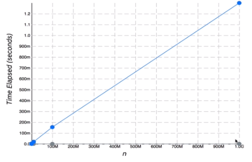

### Big O 를 소개하자면..

Big O Notation은 불분명한 카운팅을 형식화하는 방법이다.

인풋이 많아질 수록 알고리즘의 런타임이 어떻게 커지는지에 대해서 형식적으로 말할 수 있게 한다.

우리는 디테일에 대해서 신경쓰지 않을것이다. 오직 **트렌드**를 신경쓰자

## Big O 정의

만약 컴퓨터가 할 간단한 연산의 갯수가 `n`이 증가하면서 결국 상수 시간 `f(n)`보다 적다면 알고리즘이 `O(f(n))`이라고 한다.

인 경우")

인 경우")

인 경우")

### Big O 표현법 간단히 하기

- 상수는 신경쓰지 않는다

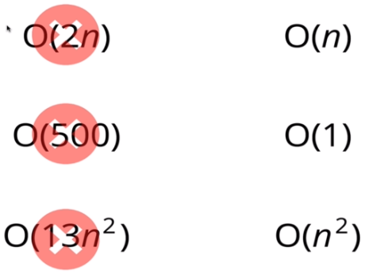

- 작은 숫자는 신경쓰지 않는다

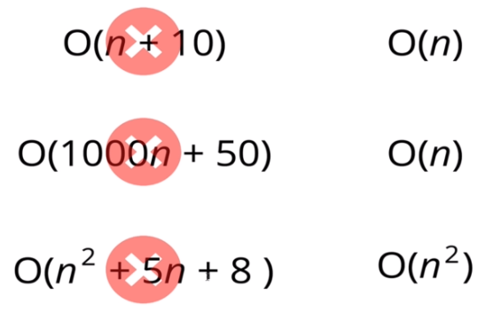

1. 산술(arithmetic)연산 ⇒ constant
2. 변수 할당 ⇒ constant
3. array의 element 접근 (by index) 또는 object의 element 접근(by key) ⇒ constant
4. loop에서, 복잡도는 loop 안에서 무슨일이 일어나든간에 loop한 횟수(길이)이다.

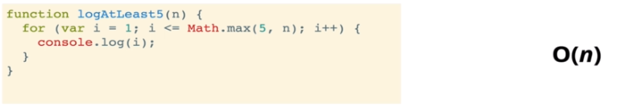

⇒ n이 급격하게 커지면 n만큼 커짐

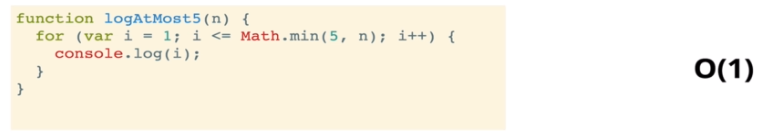

⇒ n이 급격하게 커져도 최대 5번밖에 loop를 돌지 않는다.

### Space Complexity(공간복잡도)

우리는 인풋이 늘어남에 따라 어떻게 알고리즘의 *런타임*을 측정하는지에 대한 ⇒ **time complexity**(시간 복잡도)에 대해서 이야기했다.

우리는 또한 Big-O notation으로 코드를 실행하기위해 얼마나 많은 추가적인 메모리를 할당해야 하는지에 대한 ⇒ **space complexity**를 측정할 수 있다.

### inputs은 어쩌고 ?

때때로 당신은 인풋에 의해 포함되는 공간을 제외하고, 알고리즘에 의해 요구되는 공간을 언급하는 **auxiliary space(구조가 주어진 자료를 저장하기 위해 사용하는 공간) complexity**라는 용어를 들어본적이 있을것이다.

우리가 space complexity라고 이야기하는것은 기술적으로 우리는 auxiliary space complexity를 언급하는 것이다. ⇒ 즉 input은 신경쓰지 않는다

알고리즘 내부의 영향을 신경쓰자.

### 자바스크립트에서 공간복잡도

- 대부분의 primitives( `boolean` , `numbers` , `undefiend` , `null` ) ⇒ constant space
- String ⇒ O(n) space (n은 string 길이)
- 레퍼런스 타입(arrays,object) ⇒ O(n) (n은 배열에서는 배열의 길이, 객체는 key의 갯수)

### 시간이아니라 공간을 생각하자!

#### 예제

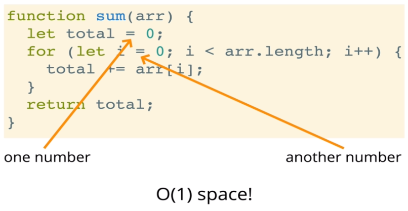

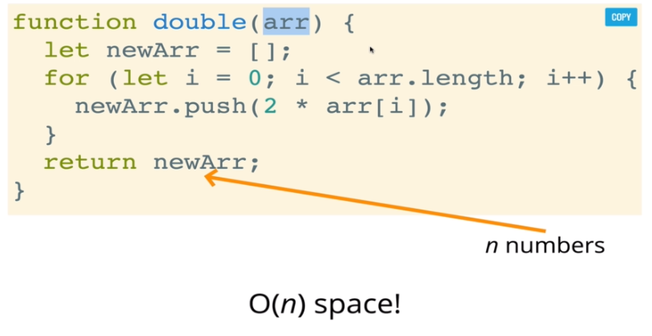

### Logarithms

- 우리는 O(1),O(n),O(n^2)과 같은 복잡도를 자주 보겠지만, 가끔은 Big O 표현법이 좀더 복잡한 수학적 표현식을 가질때가 있다. 주로 보이는것이 바로 logarithm이다.

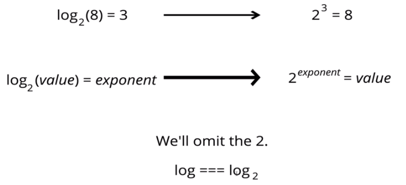

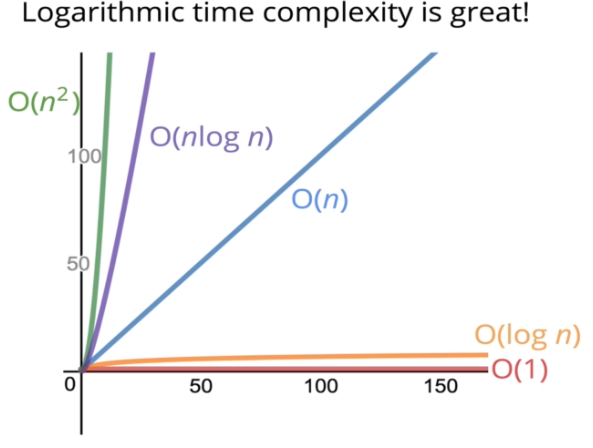

### 복습

- 알고리즘의 성능을 측정하기 위해서 Big O 표기법을 사용했다.
- Big O 표기법은 알고리즘의 시간/공간 복잡도를 매우 잘 이해시킨다.
- Big O 표기법은 정확도를 신경쓰는게 아니라 일반적인 트렌드를 말한다.(선형? 상수? 이차?)
- (Big O로 측정한) 시간 또는 공간 복잡도는 알고리즘을 실행하는데 사용된 하드웨어가 아니라 오직 알고리즘에 의존한다.
- Big O 표기법은 어디든지 있다. 많은 연습이 필요하다!