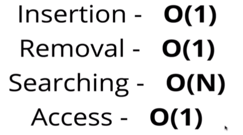
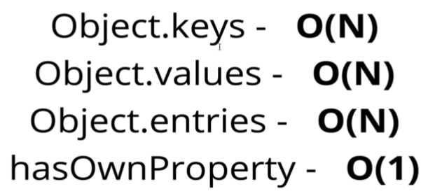
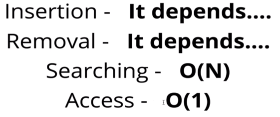
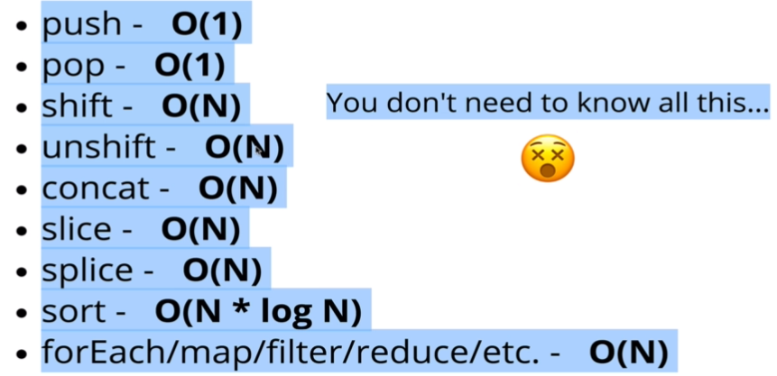

> _Udemy 강의를 듣고 직접 정리한 요약본입니다._

## Object

- 정렬되지 않아 있으며, key-value 쌍을 이룬다.

```javascript
let instructor = {
  firstName: "Kelly",
  isInstructor: true,
  favoriteNumbers:[1,2,3,4]
}
```

### 언제 Object를 사용하는가?

- 순서가 필요 없을 때
- 빠른 접근/삽입 그리고 제거가 필요할때

### Object의 Big-O



- 순서가 필요 없을때, objects가 매우 좋은 선택이다!

### Object 메서드의 Big-O



## Array

- 순서있는 리스트!

```javascript
let names = ["Michael","Melissa","Andrea"];

let values = [true, {}, [], 2, "Awesome"];
```

### 언제 Arrays를 사용하는가?

- 순서가 필요할때
- 빠른 접근 + 삽입/제거(어느정도..)



- Insertion
  - 맨 앞에 삽입 ⇒ 배열 각 엘리먼트의 인덱스를 뒤로 밀어줘야함 ⇒ `O(n)`
  - 맨 뒤에 삽입 ⇒ `O(1)`
- Remove
  - 맨 앞에 삭제 ⇒ 배열 각 엘리먼트의 인덱스를 앞으로 당겨줘야함 ⇒ `O(n)`
  - 맨 뒤에 삭제 ⇒ `O(1)`

즉, push/pop 이 언제나 shift보다 빠르다

### Array Operation의 Big O

