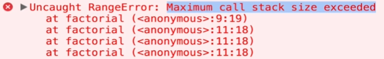
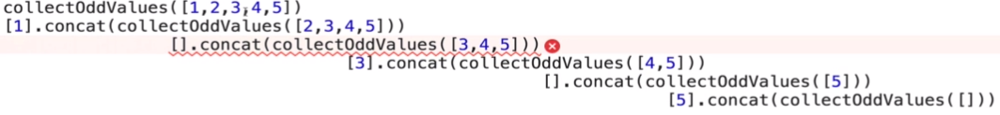

> _Udemy 강의를 듣고 직접 정리한 요약본입니다._

### 목표

- recursion이 무엇인지 ,어떻게 사용하는지 정의한다
- recursive function에서 중요한 두 필수 요소를 이해한다.
- 더 나은 디버그와 recursive function을 이해하기 위해 call stack을 시각화 한다.
- 좀 더 어려운 문제를 풀기 위해 helper method recursion 과 pure recursion을 사용한다.

### What is Recursion?

A **process** (a function in our case) that **calls itself**

⇒ **자기자신을 호출**하는 **프로세스**(우리의 경우 함수)

### 어디든 있다!

- `JSON.parse` / `JSON.stringify`
- `document.getElementById` / `DOM` traversal algorithms
- `Object` traversal
- 우리는 더욱 더 복잡한 자료 구조를 보게 될 것이다.

### 자바스크립트에서 함수가 호출 될때의 내막

- 대부분의 모든 프로그래밍 언어는 함수가 호출 될 때 어떻게 발생 할 것인지 관리하는 자료구조가 내장되어 있다.

**⇒ Call Stack**

```javascript
// 크롬 디버거로 찍어보자
function takeShower(){
    return "Showering!"
}

function eatBreakfast(){
    let meal = cookFood()
    return `Eating ${meal}`
}

function cookFood(){
    let items = ["Oatmeal", "Eggs", "Protein Shake"]
    return items[Math.floor(Math.random()*items.length)];
}
function wakeUp() {
    takeShower()
    eatBreakfast()
    console.log("Ok ready to go to work!")
}

wakeUp()
```

### Call Stack

- Stack data structure이다. ⇒ 나중에 이야기하자
- 언제든 함수가 호출되면 함수는 call stack의 맨위(top)에 위치하게 된다(**pushed**)
- Javascript가 **return** 키워드를 보고 함수가 끝날때, 컴파일러가 제거한다(**pop**)

### 왜 신경써야 하지?

- 우린 주로 call stack에 함수를 pushed 하고 끝날때 popped 한다.
- 그러나 recursive function을 쓸때는, 우리는 계속해서 새로운 함수를 call stack에 pushing한다!

### Recursive function은 어떻게 동작하나?

- 당신의 base case에 도달하기 전까지 서로 다른 인풋으로 **동일한** 함수를 호출한다.
(⇒ Invoke the **same** function with a different input untill you reach your base case!)

### Base Case :

- **재귀가 끝날때의 조건**
(⇒The Condition when the recursion ends)
- 이해하기 위한 가장 중요한 컨셉이다.
(⇒**This is the most important concept to understand**)

### recursive function에서 중요한 두 부분

- Base Case
- Different Input

### 우리의 첫 recursive function

```javascript
function countDown(num) {
  if (num <= 0) {
    console.log("All Done!");
    return;
  }
  console.log(num);
  num--;
  countDown(num);
}
```

우리가 input으로 넣은 값에 따라 숫자를 하나씩 감소하며 (5 .. 4.. 3... 2.. 1..) 0에서 종료되는 재귀함수

### 두번째 recursive function

```javascript
function sumRange(num){
    if(num === 1) return 1;
    return num + sumRange(num-1);
}
```

- base case를 발견 할 수 있는가?  `if(num === 1) return 1;`
- 서로다른 input을 알수 있는가?
- 우리가 리턴을 하지 않는다면 무슨 일이 일어나는가?

### Iteratively 하게 Factorial 쓰기

```javascript
function factorial(num) {
  let total = 1;
  for (let i = num; i > 1; i--) {
    total *= i;
  }
  return total;
}
```

### Recursively 하게 Factorial 쓰기

```javascript
function factorial(num) {
  if (num === 1) return 1;
  return num * factorial(num - 1);
}
```

## 흔한 Recursion 함정(⇒Common Recursion Pitfalls)

### 문제가 발생하는 경우들

- 끝나는 지점이 없음 또는 잘못됨 (⇒ No base case)
- 리턴하는걸 잊어먹거나, 잘못된 것을 리턴함 (⇒ Forgetting to return or returning the wrong thing!)
- Stack overflow!

```javascript
function factorial(num) {
  if (num === 1) return 1;
  return num * factorial(num); // num이 줄지 않고 계속 쌓임
}
```

```javascript
function factorial(num) {
  if (num === 1) console.log(1); // => base case가 아닌 단순히 로그를 찍고 넘어감 
  return num * factorial(num - 1); // => 계속해서 줄어들면서 계속 쌓임
}
```

이렇게 쓰면 !



## HELPER METHOD RECURSION

⇒ recursive로 돌지 않는 바깥 함수가 recursive한 내부 함수를 호출하는 패턴

### 예제

```javascript
function outer(input) {
  var outerScopedVariable = [];

  function helper(helperInput) {
    //outerScopedVariable을 수정하라
    helper(helperInput--);
  }

  helper(input);

  return outerScopedVariable;
}
```

### 다른 예제

- 모든 홀수 값들만 배열에 모으자!
- helper를 쓰는 이유는 ? `result = []`를 재귀함수 안에다 쓰면 다시 돌아올때마다 리셋되므로 바깥에 써주고, 재귀함수는 안에서 따로 도는 식으로..

```javascript
function collectOddValues(arr) {
  let result = [];

  function helper(helperInput) {
    if (helperInput.length === 0) {
      return;
    }

    if (helperInput[0] % 2 !== 0) {
      result.push(helperInput[0]);
    }

    helper(helperInput.slice(1));
  }

  helper(arr);

  return result;
}
```

## PURE RECURSION

⇒ helper를 쓰지 않고 순수하게 재귀함수로만.

```javascript
function collectOddValues(arr) {
  let newArr = [];

  if (arr.length === 0) {
    return newArr;
  }

  if (arr[0] % 2 !== 0) {
    newArr.push(arr[0]);
  }

  newArr = newArr.concat(collectOddValues(arr.slice(1)));
  return newArr;
}
```

아래와 같은 모습으로 진행된다..



- 여기선 [concat](https://developer.mozilla.org/ko/docs/Web/JavaScript/Reference/Global_Objects/Array/concat)을 사용했다.

helper method가 좀더 직관적이다. 강사는 이 helper를 쓰는걸 선호..

### Pure Recursion Tips

- arrays에서, `slice`,`the spread operator`, `concat`과 같은 method들을 사용하면 배열의 복사본(copies)을 만든다. 그러므로 그들을 변형(mutate)시키지 말아야 한다.
- string들은 변형불가(immutable)하다는것을 기억해라. 그러므로 우리는 string의 복사본을 만들기 위해 `slice`, `substr`, `substring`을 쓸 필요가 있다.
- object의 복사본을 만들기 위해선 `Object.assign`, `the spread operator`를 사용한다.