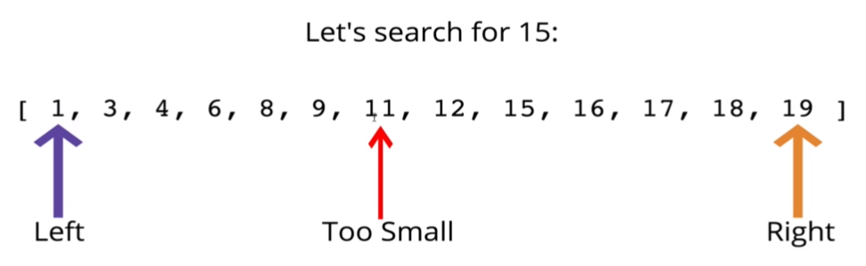
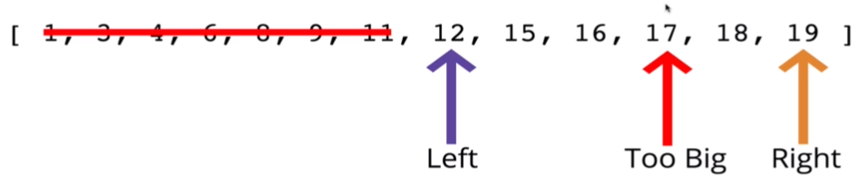
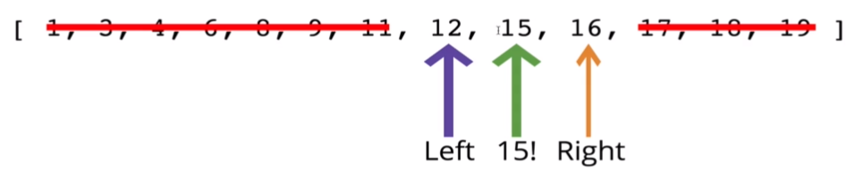
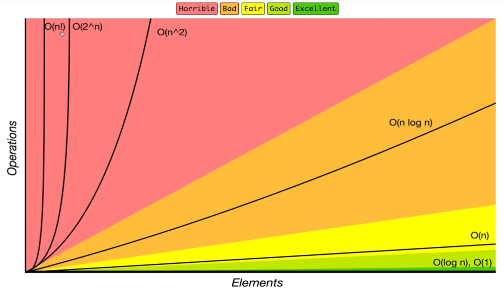

> _Udemy 강의를 듣고 직접 정리한 요약본입니다._

예를들어 유저 네임으로 여러명의 이름이 존재할때 내가 새로운 유저네임을 만들려 할때 중복인지 아닌지 어떻게 판단 할 수 있을까?

## 목표

- Searching Algorithms이 무엇인지 설명한다
- array에서 linear search를 구현한다
- sorted array에서 binary search를 구현한다
- naive string searching algorithms을 구현한다

## Linear Search

### 우리는 어떻게 검색하는가?

배열이 주어졌을때, 값을 찾는 가장 쉬운방법은 배열안의 모든 요소를 보고 우리가 원하는 값이 맞는지 체크하는것이다. ⇒ Linear Search

### 자바스크립트는 search를 갖고있다.

자바스크립트 배열에는 서로다른 많은 search 메서드가 존재한다.

- `indexOf`
- `includes`
- `find`
- `findIndex`

 그러나 이러한 기능이 어떻게 동작하나? ⇒ Linear Search

### Linear Search 수도코드

- 이 함수는 array와 value를 받는다
- 배열을 루프하면서 현재 array 요소가 value와 같은게 있는지 체크한다
- 있으면 요소가 있는 인덱스를 리턴하고
- 값이 없으면 -1을 리턴한다.

⇒ 빌트인 메서드 `IndexOf` 내부에서 일어나는 일이다.

**⇒ Time : `O(n)`**

### Linear Search에서 Big O는?

- `O(n)` ⇒ 안좋거나 평균적인 케이스. 그러니까 최소 O(n)은 돼야 한다.
- `O(1)` ⇒ 베스트 케이스. 희귀함

## Binary Search

- Binary Search는 Search의 가장 빠른 Form이다.
- 한번에 하나의 요소를 제거하기보다, 우리는 한번에 남은 요소의 ***절반(half)***을 없앨 수 있다.
- Binary Search는 오직 **정렬된(⇒ *sorted)* arrays**에서만 동작한다!

### Divide and Conquer

- 이것은 마치 소주뚜껑에 써진 숫자를 맞추는 술 게임과 같다..

### Binary Search 수도코드

- **sorted array**와 value를 받는다
- 배열의 시작부분에 왼쪽 포인터를 만들고 배열의 끝부분에 오른쪽 포인터를 만든다.
- `While(left pointer < right pointer)`:
  - 중간 포인터를 만든다
  - 원하는 값을 찾았다면 인덱스를 리턴
  - 값이 너무 작다면, 왼쪽 포인터를 증가시킨다(중간 포인터값으로)
  - 값이 너무 크다면, 오른쪽 포인터를 감소시킨다 (중간 포인터 값으로)
- 값이 없다면 -1을 리턴한다.

### Binary Search 에서 Big O는?

- `O(log n)` ⇒ 가장 안좋거나 평균적인 케이스. 그러니까 적어도 `log n` 은 돼야한다는 소리.
- `O(1)` ⇒ 베스트 케이스. 희귀함.

**⇒ Time : `O(log N)`**

### 시간 복잡도에 따른 평가

## Naive String Search

### 수도코드

- 긴 string을 루프한다
- 짧은 string을 루프한다
- 만약 characters가 맞지 않는다면 , inner loop를 탈출하라
- 만약 characters가 맞으면, 계속 진행하라
- 만약 inner loop를 완료하고 매치되는것을 찾았다면, count를 증가시켜라
- count를 리턴하라
