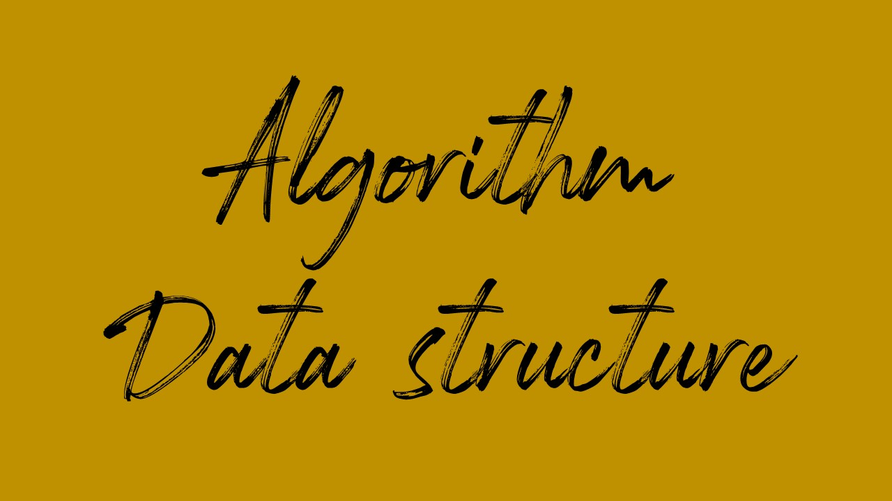
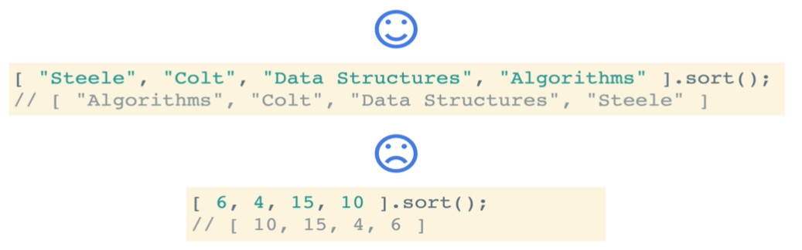

> _Udemy 강의를 듣고 직접 정리한 요약본입니다._

## Sorting이 무엇인가?

Sorting은 콜렉션(예를들어 array) 안의 아이템들을 재배치(rearrange)하는 일련의 과정이다. 

그러므로 아이템들은 일종의 질서를 갖는다.

### 예

- 작은것 부터 큰 순서대로 numbers Sorting (오름차순,내림차순..)
- 이름 알파벳 순서(a→z)대로 Sorting (오름차순, 내림차순..)
- 영화 개봉 연도별로 Sorting
- 영화 평점별로 Sotring

### 왜 이걸 배워야 하나?

- Sorting은 매우 흔한 일이다. 그러므로 그것이 어떻게 작동하는지 알아두는것은 매우 좋다.
- Sort를 하는 방법은 매우 다양하고 각각의 방법마다 **그들의 장점과 단점이 존재**한다.

### 참고 웹사이트

- [정렬 알고리즘 성능 비교](https://www.toptal.com/developers/sorting-algorithms)

### 목적

- 버블 정렬(bubble sort) 구현
- 선택 정렬(selection sort) 구현
- 삽입 정렬(insertion sort) 구현
- 이러한 간단한 정렬 알고리즘을 배우는것이 왜 중요한지 이해한다.

### 자바스크립트는 sort 메서드를 가지고 있는가?

⇒ [Array.prototype.sort()](https://developer.mozilla.org/en-US/docs/Web/JavaScript/Reference/Global_Objects/Array/sort) 가지고 있다!

⇒ 하지만 항상 우리가 예상한대로 작동하진 않는다.



### 자바스크립트에게 어떻게 정렬 할 것인지 알려주자

- 내장 sort 메서드는 optional ***comparator*** 함수를 받는다.
- 이 comparator function을 사용해서 자바스크립트에게 어떻게 정렬할지 알려 줄 수 있다.
- comparator를 살펴보면, 리턴 값에 따라 그들의 sort order를 결정하는 엘리먼트의 쌍(a 그리고 b)들로 이루어져 있다.

<br>

- negative number(작은 수부터..)를 리턴하고 싶다면, a는 b 이전에 와야한다.(a,b)

```javascript
function numberCompare(num1, num2){
  return num1 - num2 // << 다른부분
}

[6,4,15,10].sort(numberCompare)
// [4, 6, 10, 15]
```

- positive number(큰 수부터..)를 리턴하고 싶다면, a는 b 이후에 와야한다. (b,a)

```javascript
function numberCompare(num1, num2){
  return num2 - num1 // << 다른부분
}

[6,4,15,10].sort(numberCompare)
// [15, 10, 6, 4]
```

- 0을 리턴하고 싶다면 sort를 고려하는 한, a와 b는 동일하다.