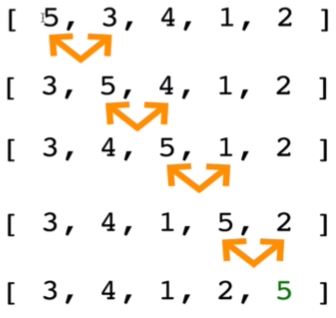
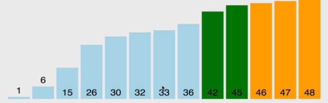

> _Udemy 강의를 듣고 직접 정리한 요약본입니다._

- 참고 사이트 : [비쥬알고](https://visualgo.net/en/sorting)

**하나의 값과 그 옆의 값을 비교하면서 가장 큰 값을 맨 위(top)! 로 버블 업 하는 정렬 알고리즘**



## 정렬(sort)하기전에 반드시 서로 교체(swap)해야한다!

많은 정렬 알고리즘은 어떤 타입의 swapping function과 연관이 있다.(예 : 순서를 맞춰 넣기 위해 숫자를 스왑)

```javascript
// ES 5 => 이쪽이 보기에는 좀더 직관적...
function swap(arr,idx1,idx2) {
  var temp = arr[idx1];
  arr[idx1] = arr[idx2];
  arr[idx2] = temp;
}

// ES2015
const swap = (arr,idx1,idx2) => {
  [arr[idx1],arr[idx2]] = [arr[idx2],arr[idx1]];
}
```

## BubbleSort 수도코드

- 변수 `i`를 배열의 시작부터 끝까지 향하며 루프
- 내부 루프를 변수 `j`로 처음부터 `i-1`까지 루프
- 만약 `arr[j]`가 `arr[j+1]`보다 크다면 두 값을 스왑
- 정렬된 배열을 리턴

## 단순한 버블정렬

```javascript
function BubbleSort(arr) {
  let count = 0;
  for (let i = 0; i < arr.length; i++) {
    count++;
    console.log(`=====${count}회차 시작=====`);
    // 단순히 배열 요소만큼 루프하는데 의미를 두는것...
    // 딱히 i를 쓰기 위한게 아님
    for (let j = 0; j < arr.length; j++) {
      console.log(`[${arr}] --- ${arr[j]} vs ${arr[j + 1]}`);
      if (arr[j] > arr[j + 1]) {
        let temp = arr[j];
        arr[j] = arr[j + 1];
        arr[j + 1] = temp;
      }
    }
    console.log(`=====${count}회차 끝=====`);
  }
  return arr;
}

console.log("결과:", BubbleSort([37, 45, 29, 8]));
```

### 결과

```shell
=====1회차 시작=====
[37,45,29,8] --- 37 vs 45
[37,45,29,8] --- 45 vs 29
[37,29,45,8] --- 45 vs 8
[37,29,8,45] --- 45 vs undefined // < 필요없는 부분
=====1회차 끝=====

=====2회차 시작=====
[37,29,8,45] --- 37 vs 29
[29,37,8,45] --- 37 vs 8
[29,8,37,45] --- 37 vs 45 // < 필요없는 부분
[29,8,37,45] --- 45 vs undefined // < 필요없는 부분
=====2회차 끝=====

=====3회차 시작=====
[29,8,37,45] --- 29 vs 8
[8,29,37,45] --- 29 vs 37 // < 필요없는 부분
[8,29,37,45] --- 37 vs 45 // < 필요없는 부분
[8,29,37,45] --- 45 vs undefined // < 필요없는 부분
=====3회차 끝=====

=====4회차 시작=====
[8,29,37,45] --- 8 vs 29 // < 필요없는 부분
[8,29,37,45] --- 29 vs 37 // < 필요없는 부분
[8,29,37,45] --- 37 vs 45 // < 필요없는 부분
[8,29,37,45] --- 45 vs undefined // < 필요없는 부분
=====4회차 끝=====

결과: [ 8, 29, 37, 45 ]
```

## 수정된 버블정렬

필요없는 부분의 연산을 없애기 위해 수정한다.

```javascript
function BubbleSort(arr) {
  let count = 0;
  for (let i = arr.length; i > 0; i--) {
    count++;
    console.log(`=====${count}회차 시작=====`);
    // i를 배열의 길이 (여기선 4)로 시작해 0보다 클 동안
    // i를 감소시키면서 진행한다.
    // 횟수는 4회로 동일하다.
    for (let j = 0; j < i - 1; j++) {
      // 여기서 이제 j가 j<3, j<2, j<1 로 돌게된다.
      console.log(`array:[${arr}] --- ${arr[j]} vs ${arr[j + 1]}`);
      if (arr[j] > arr[j + 1]) {
        let temp = arr[j];
        arr[j] = arr[j + 1];
        arr[j + 1] = temp;
      }
    }
    console.log(`=====${count}회차 끝=====`);
  }
  return arr;
}

console.log(BubbleSort([37, 45, 29, 8]));
```

### 결과

```shell
=====1회차 시작=====
array:[37,45,29,8] --- 37 vs 45
array:[37,45,29,8] --- 45 vs 29
array:[37,29,45,8] --- 45 vs 8
=====1회차 끝=====

=====2회차 시작=====
array:[37,29,8,45] --- 37 vs 29
array:[29,37,8,45] --- 37 vs 8
=====2회차 끝=====

=====3회차 시작=====
array:[29,8,37,45] --- 29 vs 8
=====3회차 끝=====

=====4회차 시작=====
=====4회차 끝=====

[ 8, 29, 37, 45 ]
```

## 최적화된 버블정렬



사람이 보기엔 여기까지 했으면 이미 정렬이 완료됐다고 볼 수 있다.

그러나 컴퓨터는 마지막까지 계속 루프한다(위 코드에서 4회차에 아무것도 하지 않지만 돌았던 것처럼) ⇒ **매우 긴 배열에선 문제가 될 수 있다.**

위에서 썼던 코드를 그대로 가져와서 인풋값만 바꿔서 진행. 

```javascript
function BubbleSort(arr) {
  for (let i = arr.length; i > 0; i--) {
    for (let j = 0; j < i - 1; j++) {
      if (arr[j] > arr[j + 1]) {
        let temp = arr[j];
        arr[j] = arr[j + 1];
        arr[j + 1] = temp;
      }
    }
  }
  return arr;
}

console.log(BubbleSort([8, 1, 2, 3, 4, 5, 6, 7]));
```

### 결과

```shell
=====1회차 시작=====
array:[8,1,2,3,4,5,6,7] --- 8 vs 1
array:[1,8,2,3,4,5,6,7] --- 8 vs 2
array:[1,2,8,3,4,5,6,7] --- 8 vs 3
array:[1,2,3,8,4,5,6,7] --- 8 vs 4
array:[1,2,3,4,8,5,6,7] --- 8 vs 5
array:[1,2,3,4,5,8,6,7] --- 8 vs 6
array:[1,2,3,4,5,6,8,7] --- 8 vs 7
=====1회차 끝=====

=====2회차 시작=====
array:[1,2,3,4,5,6,7,8] --- 1 vs 2
array:[1,2,3,4,5,6,7,8] --- 2 vs 3
array:[1,2,3,4,5,6,7,8] --- 3 vs 4
array:[1,2,3,4,5,6,7,8] --- 4 vs 5
array:[1,2,3,4,5,6,7,8] --- 5 vs 6
array:[1,2,3,4,5,6,7,8] --- 6 vs 7
=====2회차 끝=====     // < 여기서 끝나야 한다.

//이하 불필요한 부분

=====3회차 시작=====
array:[1,2,3,4,5,6,7,8] --- 1 vs 2
array:[1,2,3,4,5,6,7,8] --- 2 vs 3
array:[1,2,3,4,5,6,7,8] --- 3 vs 4
array:[1,2,3,4,5,6,7,8] --- 4 vs 5
array:[1,2,3,4,5,6,7,8] --- 5 vs 6
=====3회차 끝=====

=====4회차 시작=====
array:[1,2,3,4,5,6,7,8] --- 1 vs 2
array:[1,2,3,4,5,6,7,8] --- 2 vs 3
array:[1,2,3,4,5,6,7,8] --- 3 vs 4
array:[1,2,3,4,5,6,7,8] --- 4 vs 5
=====4회차 끝=====

=====5회차 시작=====
array:[1,2,3,4,5,6,7,8] --- 1 vs 2
array:[1,2,3,4,5,6,7,8] --- 2 vs 3
array:[1,2,3,4,5,6,7,8] --- 3 vs 4
=====5회차 끝=====

=====6회차 시작=====
array:[1,2,3,4,5,6,7,8] --- 1 vs 2
array:[1,2,3,4,5,6,7,8] --- 2 vs 3
=====6회차 끝=====

=====7회차 시작=====
array:[1,2,3,4,5,6,7,8] --- 1 vs 2
=====7회차 끝=====

=====8회차 시작=====
=====8회차 끝=====

[ 1, 2, 3, 4, 5, 6, 7, 8 ]
```

바뀔 부분이 없으면 탈출한다 ⇒ `noSwaps` 추가

```javascript
function BubbleSort(arr) {
  let noSwaps; // noSwaps 변수 선언

  for (let i = arr.length; i > 0; i--) {
    noSwaps = true; // noSwaps는 항상 true로 시작한다.

    for (let j = 0; j < i - 1; j++) {
      if (arr[j] > arr[j + 1]) {
        let temp = arr[j];
        arr[j] = arr[j + 1];
        arr[j + 1] = temp;
        noSwaps = false; // 바꿀 사항이 있었다면 변수를 false로 바꾼다.
      }
    }

    if (noSwaps) break; 
		// 바꿀 사항이 있었다면(noSwaps = false) 거치지 않을것이고
		// 바꿀 사항이 없었다면(noSwaps = true) 탈출한다.

  }
  return arr;
}

console.log(BubbleSort([8, 1, 2, 3, 4, 5, 6, 7]));
```

### 결과

```shell
=====1회차 시작=====
array:[8,1,2,3,4,5,6,7] --- 8 vs 1
array:[1,8,2,3,4,5,6,7] --- 8 vs 2
array:[1,2,8,3,4,5,6,7] --- 8 vs 3
array:[1,2,3,8,4,5,6,7] --- 8 vs 4
array:[1,2,3,4,8,5,6,7] --- 8 vs 5
array:[1,2,3,4,5,8,6,7] --- 8 vs 6
array:[1,2,3,4,5,6,8,7] --- 8 vs 7
=====1회차 끝=====  

=====2회차 시작=====
array:[1,2,3,4,5,6,7,8] --- 1 vs 2
array:[1,2,3,4,5,6,7,8] --- 2 vs 3
array:[1,2,3,4,5,6,7,8] --- 3 vs 4
array:[1,2,3,4,5,6,7,8] --- 4 vs 5
array:[1,2,3,4,5,6,7,8] --- 5 vs 6
array:[1,2,3,4,5,6,7,8] --- 6 vs 7
=====2회차 끝===== 
// 바꿀것이 없다
// arr[j] > arr[j + 1] 조건을 거치치 않으므로 noSwaps = true로
// 바깥 루프의 남은 회수를 돌지 않고 break!

[ 1, 2, 3, 4, 5, 6, 7, 8 ]
```

## 버블 정렬 : BIG O

일반적으로, nested loop를 사용했으므로 ⇒ Time : `O(n^2)`

그렇지만, 배열이 정렬 또는 거의 정렬 되어 있다면 최적화된 버블정렬 사용 시 ⇒ Time ≈ `O(n)`

그러므로 거의 정렬되어 있다면 버블정렬도 하나의 선택할 수 있는 후보가 될 수 있다.