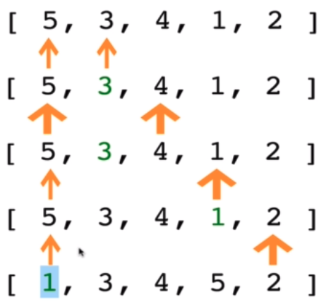

> _Udemy 강의를 듣고 직접 정리한 요약본입니다._

버블 정렬과 비슷하지만 큰 값을 정렬된 자리에 두는게 아닌, 작은 값을 정렬된 자리에 넣는다.



## Selection Sort 수도코드

- 첫번째 요소를 아직까진 지금까지 본 값 중 가장 작은 값으로 저장하자.
- 더 작은 수를 찾을 때 까지 배열에서 이 아이템을 그 다음 아이템과 비교한다.
- 만약 더 작은 수를 찾으면, 그 작은 수를 새로운 "최솟값"으로 가리키고 배열이 끝날 때 까지 계속한다.
- 만약 "최솟값"이 우리가 시작할 때 설정한 value(index)이 아니라면, 두 값을 바꾼다.
- 이 배열이 정렬 될 때 까지 다음 요소에 대해  이 과정을 반복한다.

```javascript
function SelectionSort(arr) {
  for (let i = 0; i < arr.length; i++) {
    let minimumIdx = i;
    for (let j = i + 1; j < arr.length; j++) {
      if (arr[minimumIdx] > arr[j]) {
        minimumIdx = j;
      }
    }
    if (minimumIdx !== i) {
      let temp = arr[i];
      arr[i] = arr[minimumIdx];
      arr[minimumIdx] = temp;
    }
  }
  return arr;
}

SelectionSort([0, 1, 5, 3, 4, 6, 2]);
```

기술적으로 보면 중첩된 루프를 진행하므로 ⇒ Time : `O(n^2)`

버블 정렬이 비교하면서 계속 스왑했던 것에 비교하면, 선택정렬은 각 루프마다 한번씩만 스왑을 진행한다.

메모리같은 부분을 걱정한다면 선택정렬이 버블정렬보다 더 나은 선택이다.