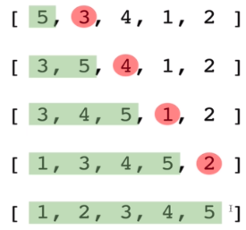

> _Udemy 강의를 듣고 직접 정리한 요약본입니다._

Bulid up the sort by gadually creating a larger left half which is always sorted

⇒ 항상 정렬되있는 왼쪽의 큰 절반을 만들어 그 정렬을 점진적으로 확대한다.

## Insertion Sort 수도코드

- 배열에서 두번째 요소를 선택하며 시작한다.
- 이제 두번째 요소를 이전의 첫번째 요소와 비교하고 필요하다면 스왑한다.
- 그다음 요소로 이동하고, 만약 요소가 순서에 맞지 않는다면 분류된 부분(왼쪽 부분)을 반복하여 요소를 정확한 위치에 배치한다.
- 배열이 정렬 될 때까지 반복한다.