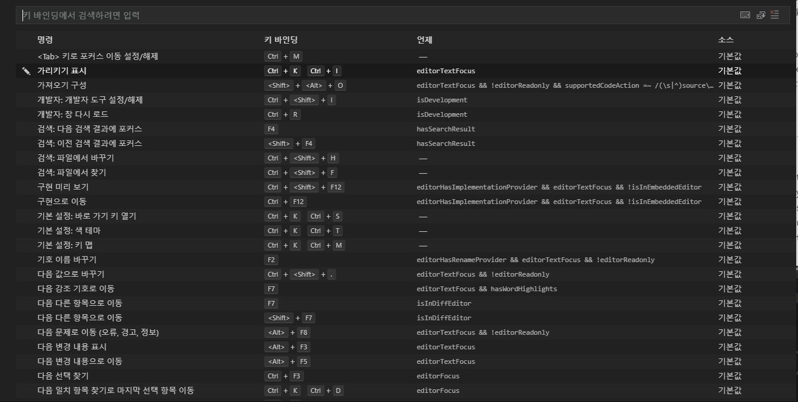
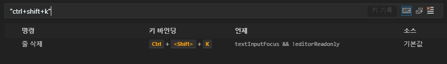
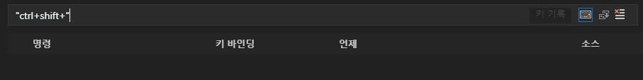

저는 편집기로 Visual Studio Code를 사용하고 있습니다. 주로 작업을 노트북에서 하는데 최근에 데스크탑에서 잠깐 작업을 하려고 셋팅을 맞추고 코딩을 하고 있었죠. 그런데 여기 데스크탑에선 같은 단어 선택인 Ctrl + Shift + l 키가 안먹히는겁니다. 

그래서 세팅을 잘못했나 싶어서 키 바인딩 설정을 찾아보는데 아직 에디터가 익숙하지 않아서👶 잘 못찾겠어서 구글링해봤습니다.

## 설정법

_왼쪽 상단 "파일(File)" -> "기본 설정(Preference)" -> "바로가기 키(Keyboard Shortcuts)"_

를 누르면 설정 화면이 나옵니다.

검색 창 오른쪽에 보면 세가지 아이콘이 있는데 첫번째 키보드 모양 아이콘을 눌러주면

지금부터 누르는 키를 감지합니다.

이렇게 직접 쓰는 키를 검색해서 바로 찾아 낼 수도 있습니다.

- - -

이미 VSC를 많이 쓰시는 고수분들은 잘 아실 내용들이지만 한번씩 까먹을 때가 있으니까요.

여기 공식문서도 있습니다.

[Key Bindings for Visual Studio Code](https://code.visualstudio.com/docs/getstarted/keybindings)

만세~ 다시 키 셋팅을 설정하러 가볼까~👏 그렇게 해서 바로 Ctrl + Shift + l 을 눌렀는데..

Ctrl + Shift 까지만 먹히고 l이 동시에 안눌려지더군요.. 다른키는 다 눌리는데.

찾아보니 Ctrl + Shift + l 은 단축키에 이미 등록은 되어 있었습니다. 왠지 모르겠지만 키보드때문인지, 윈도우 운영체제상에서 키보드 셋팅때문인지 동시입력이 안되고 있는것 같습니다.🤯 맙소사.

저는 다른 방법을 찾으러 가야겠습니다.😭