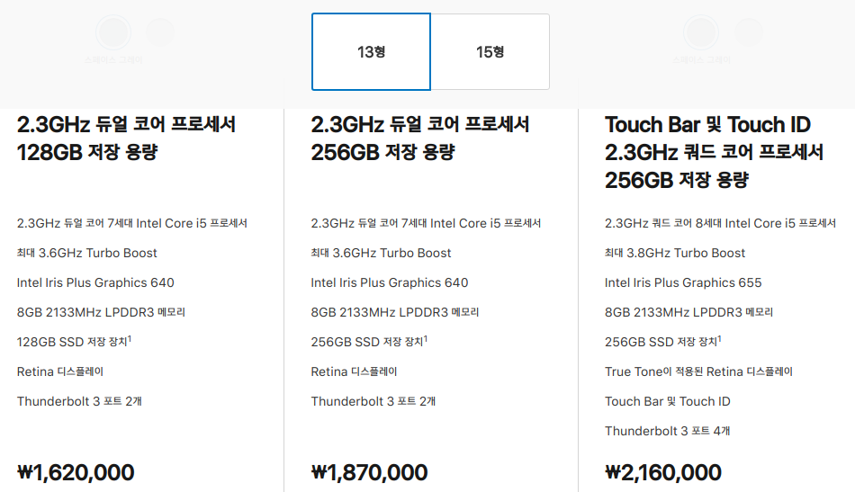
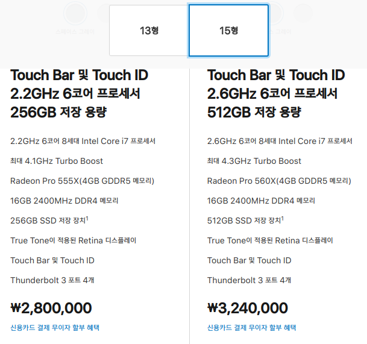
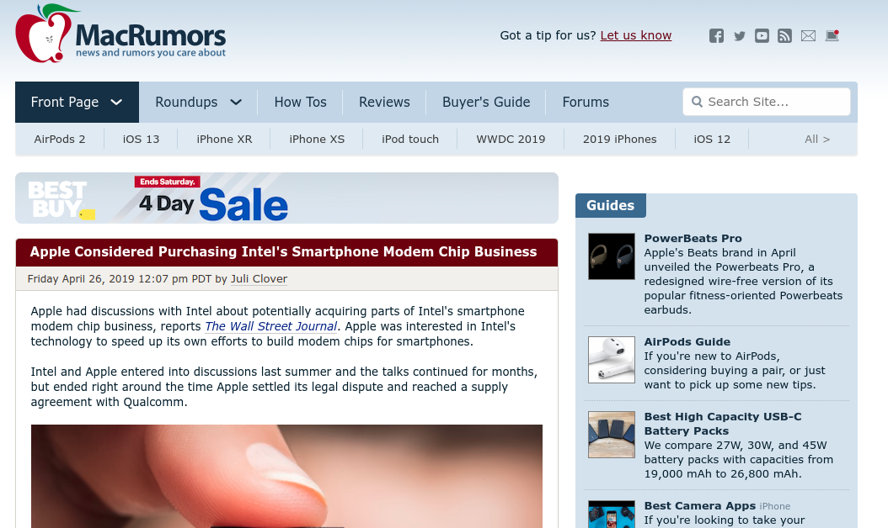
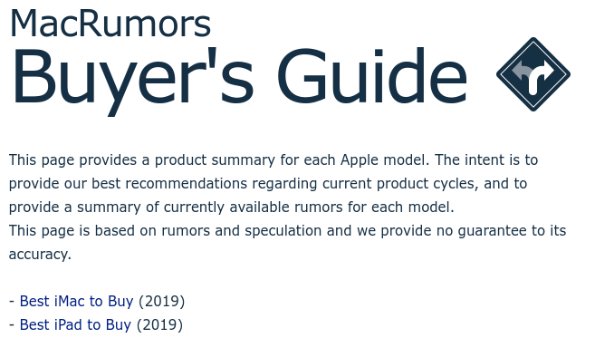
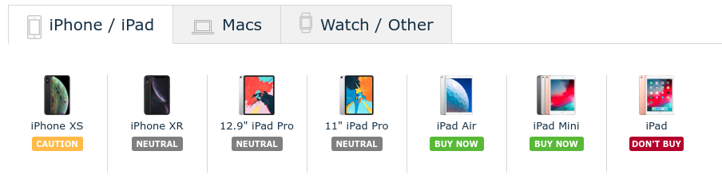
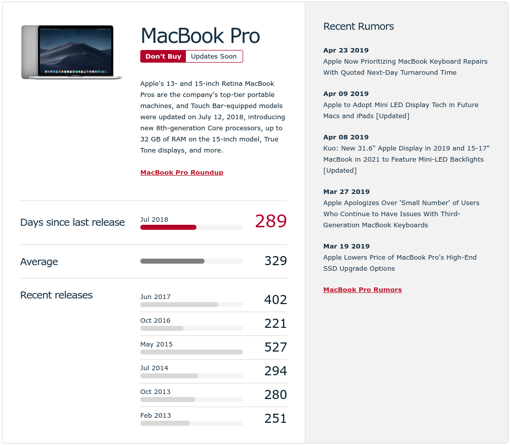

최근 한 달 전부터 맥북을 구매하고 싶은 욕구가 스멀스멀 다시 올라오고 있습니다.

사실 개발을 공부하는 초기까지만 해도 맥북을 사고 싶다는 생각은 안 해봤습니다. 어렸을 때부터 지금까지 윈도우만 사용했고, 처음 개발도 윈도우에서 시작하면서 별다른 문제는 없어 보였기 때문이죠. cmd에서도 개발은 가능했거든요.

그런데 어느 날 강의를 보면서 똑같이 따라 하며 진행하는데 해당 패키지가 제대로 작동을 안 하는 겁니다. 대체 문제가 뭔지 알 수가 없었습니다. 다른 데스크탑에 똑같이 옮겨서 실행해보고(같은 윈도우 였습니다.) 구글링해서 이것도 해보고 저것도 해보고, 컴퓨터도 껐다 켜보고, 다시 삭제하고 다시 해보고.. 이틀 정도는 고민하던 차에, 혹시 운영체제가 문제가 아닐까? 싶어서 남아도는 노트북을 밀고 우분투를 깔아 도전해보니 이야😱~ 잘 돌아가더군요.

나중엔 이게 결국 운영체제 문제라기보단 터미널 때문이라는 걸 알았죠.
그래서 윈도우에 우분투를 깔아 사용했습니다. 그러다 아예 노트북 하나를 밀고 우분투를 깔아서 현재 그걸 사용 중입니다.

우분투도 좋습니다. 처음 깔았을 때 설정할 게 좀 많고, 카카오톡이나 여타 프로그램 지원들이 조금 부족하고 그런 부분만 빼면요. 개발환경도 충분히 잘 돌아갑니다.

근데 그 2%를 채우고 싶은 욕구와 맥 운영체제를 한 번도 사용해 본 적이 없기 때문에 자꾸 맥북이 눈에 아른거리는 겁니다.‍🤦‍♂️
- - -

## 맥북 프로

[애플 교육 할인 스토어 홈](https://www.apple.com/kr-k12/shop) 현재(2019-04-27 기준) 맥북은 13인치, 15인치 두가지로 나뉩니다.

13인치는 논-터치바가 듀얼코어까지만 존재하고, __터치바 모델__ 만 쿼드코어입니다. 썬더 볼트 포트 수 라던지 디스플레이도 약간의 차이가 존재합니다. 굉장히 얍삽합니다.

다음은 15인치 모델입니다.

둘다 6코어 8세대 인털 i7프로세서를 사용합니다. 클럭수같은 구체적인 사양은 서로 다르니 참고하시기 바랍니다. 가격도 13인치보다 60만원이 뛰었네요. 논-터치바 모델은 존재하지도 않구요.

옵션장사가 장난이 아닙니다. 가격도 비싸구요.

거기다가 이번 맥북은 키보드 관련 트러블이나, 터치바에 대한 의견도 분분합니다.

저의 마지노선은 13인치에 RAM 16GB, SSD 512GB 정도로 생각하고 있었고 맞추면 적어도 250은 생각을 해야 합니다.

아. 고민됩니다. 아반떼사러 갔다가 그랜져 뽑아오는 느낌입니다. 🤔

그러다가 문득 __이거 곧 새로운 모델 나오는거 아닌가..?__ 하는 생각이 스쳐 지나갑니다.

최근에 아이패드며, 에어팟이며 새로운 모델들이 쏟아져 나오고 있었기 때문이죠.

- - -

## MacRumors

그럴때 참고하면 좋은 MacRumors 사이트입니다.

apple과 관련한 루머나 뉴스를 모아놓는 사이트입니다. 그 중에서도 위에서 5번째를 보면 __Buyers Guide__ 탭이 있습니다. 클릭해보면

애플 각 모델에 대한 요약을 제공해준다고 설명해 주네요.

그렇다면 어떻게 정리되어 있는지 봅시다.

아이폰/아이패드 탭에선 현재 

- iPhone XS 는 CAUTION(주의)
- iPhone XR, 12.9" iPad Pro, 11" iPad Pro 는 NEUTRAL(중립)
- iPad Air, iPad Mini는 BUY NOW(지금 구매)
- iPad는 DON'T BUY(사지마시오)

이런식으로 알려주는군요.

기준은 바로 __제품 발매 주기__ 입니다.

제작년 이맘때, 작년 이맘때 제품이 나왔으니 평균 사이클을 구하는겁니다.

이제 제가 사려고 하는 맥북 프로를 봐볼까요?

최근 발매된 날이 2018년 7월이 마지막이었고, 이후로 289일이 지났습니다. 평균적으로 329일에 한번씩 모델 체인지가 이뤄졌군요.
옆에는 최근 루머도 있습니다.

자 그렇다면, 평균에 의하면 저에겐 아직 2달 정도 인내할 시간이 필요합니다. 오차가 있긴 하지만, 효과는 있습니다. 

~~구매욕구가 약간 하락했습니다.~~🤥

여러분도 혹시 지름신이 올때 구매 가이드로 한번 확인해보시기 바랍니다. 조금의 현명한 판단에 보탬이 될겁니다.

#### [>>MacRumors](https://www.macrumors.com/)

> _과연 올해 맥북 프로 구매가 가능할까요?👻_