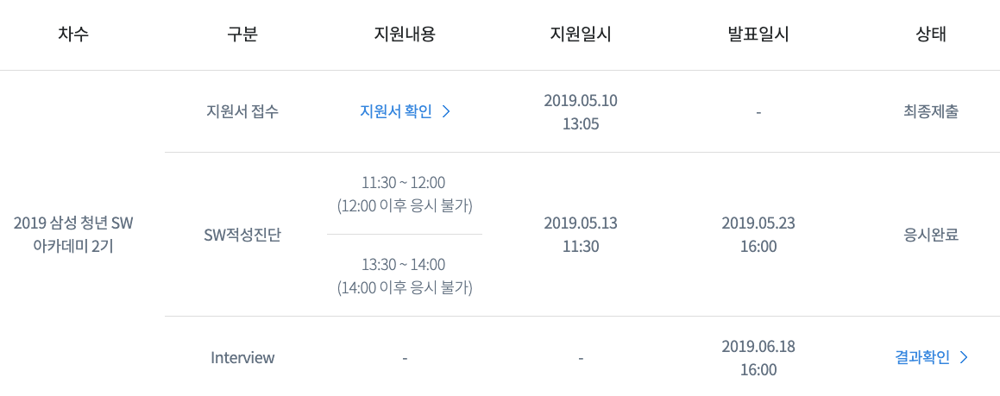

## 후기

SSAFY 2기에 최종 합격했습니다! 🤯

작년 1기에 도전했었는데, 그땐 적성진단에서 떨어졌었습니다.

1기 이후로 벌써 시간이 이렇게 지났었네요.

이번 2기 지원을 늦게 알아서 거의 마지막날에 접수하고 여차저차 하니 적성진단 합격하고, 처음으로 인터뷰를 하는 기회도 얻었습니다. 정말 좋은 경험이 됐던것 같습니다.😤

따로 돈내고 어디서 공부하거나 스터디 같은건 하지 않았고, 그냥 시험보고 인터뷰 준비해서 갔습니다.

평소에 혼자서 개발공부 한다고 이렇게 있으니 어려운점이 이만저만이 아니었습니다.

멘토도 있었으면 했고, 함께 공부할 친구들도 있었으면 더 좋겠다는 생각을 많이 했는데 제겐 더없이 좋은 기회가 될 것 같습니다.

1년간 공부 열심히 해야겠습니다. 재밌는 프로젝트도 많이 해보고 싶구요. 블로그에 올릴 소재도 많으면 좋겠습니다.

보안 관련 서약을 했기 때문에 인터뷰나 시험에 관한 질문은 정중히 거절하겠습니다. 🤐
