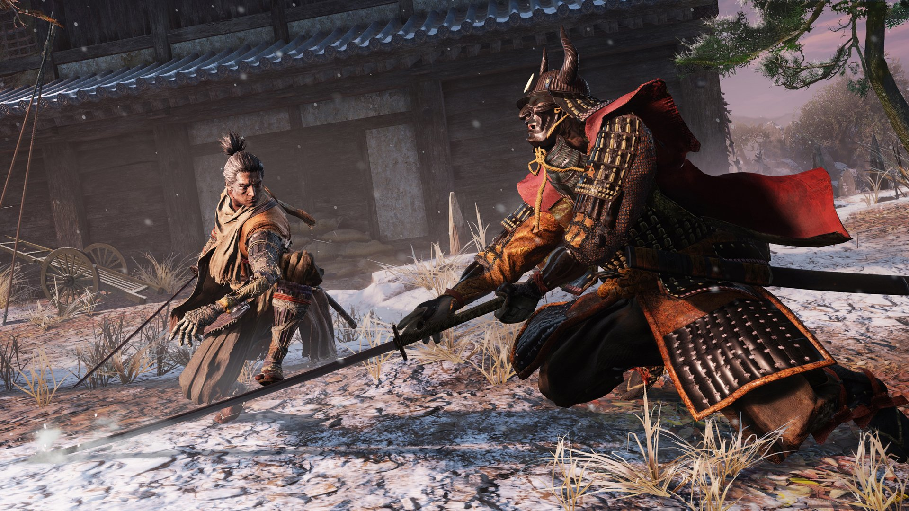

이전에 유튜브에서 티저영상으로 "SEKIRO - SHADOW DIE TWICE"의 티저영상을 봤습니다. 적당한 그래픽과 스타일리쉬하게 적들을 "인살"하는 영상을 보면서 한번 해보고 싶다는 생각이 들었었습니다.

마침 곧 생일이 다가와 누님께서 특별히 생일선물로 무얼 받고싶냐는 얘기에 주저없이 이 게임을 골랐습니다.

>__그때는 몰랐죠. 이렇게 고통에 몸부림치게 될지...__

- - -

## 악명높은 제작사, 프롬 소프트웨어

세키로의 제작사는 다크소울을 제작한 프롬소프트웨어 입니다. 게임의 난이도가 어렵기로 굉장히 유명합니다. 저도 풍문으로만 들었었죠.

사실 저같은 경우 다크소울을 플레이 해본 경험이 없기때문에, 게임이 그렇게 어렵나? 하는 의구심이 들기도 했습니다.

그리고 예습을 위해 유튜브에서 다크소울 게임 플레이 영상을 찾아봤습니다.

<iframe width="560" height="315" src="https://www.youtube.com/embed/XiSF2gM5pRs" frameborder="0" allow="accelerometer; autoplay; encrypted-media; gyroscope; picture-in-picture" allowfullscreen></iframe>

 
표정만 봐도 꽤 어려워 보입니다.

조작이나 전반적인 게임 시스템이 많은영향을 끼치는것 같습니다. 해보고 싶다는 욕구가 마구 샘솟습니다.

세키로의 경우, 다크소울과 동등, 아니 더 높다고 하는 난이도를 들고 찾아왔다고 합니다.

그리고 플레이를 시작했습니다.

플레이 영상은 __모든 보스 영상__ 으로 대체하겠습니다.

스포일러가 될 수 있으니 직접 플레이 하실 분들은 안보는게 나을것 같습니다.

<iframe width="560" height="315" src="https://www.youtube.com/embed/y_0q7U4lC5g" frameborder="0" allow="accelerometer; autoplay; encrypted-media; gyroscope; picture-in-picture" allowfullscreen></iframe>

 

- - -

## 평가

### 🔥 그래픽

그래픽의 경우, 처음엔 예상보단 약간 아쉽단 생각이 들었지만 플레이 하다보니 눈이 적응돼 괜찮아 보이더군요. 집에 있는 PC의 사양이 썩 좋지 않은 이유도 있었겠지요.

### ⚙ 게임 시스템

#### 😰 지금까지 만나보지 못했던 움직임

다크소울류? 라고 해야할까요? 약간의 부자연스러운 움직임에 약간의 적응이 필요합니다. 이후엔 괜찮습니다.

#### 🤔 불친절한 가이드

정석적인 길이 없습니다. 아 물론 어느정도는 있지만, 그냥 막 가다간 중간 보스를 건너 뛴다던지 하는 경우가 생기기도 합니다. 그리고 상점과 같은 표시도 없어서 중요한 아이템을 놓치고 다시 가서 구하기도 했습니다. 그러나 게임진행엔 영향이 없습니다. 난이도가 조금 달라질 뿐이며, 이것 또한 세키로의 묘미인듯 합니다.

#### 💕 두개의 목숨, 그리고...

플레이어는 목숨을 두개 가지고 있으며, 스토리를 진행하다 보면 1회 더 늘어나게 됩니다.(다만 더 얻은 목숨은 다시 살아나는데 조건이 붙습니다.)

이 목숨을 두개 다 잃으면 붉은색 죽을 사(__死__) 자가 화면에 뜨며 여러분을 반겨줍니다.

그리고 덤으로 가지고 있던 경험치와 돈까지 절반씩 가져가죠. 💸

명조 확률이란것도 존재해서 가끔 죽어도 돈과 경험치가 사라지지 않을 때도 있습니다. 이 경우 살아 날때 __UNSEEN AID__ 라는 문구와 함께 살아납니다.

그리고 너무 자주 죽으면 NPC들이 차례 차례 병에 걸리기도 합니다.😷(죽지는 않습니다.)

사실 이런 상황에 익숙하지 못했던 저로썬 허탈감이 매우 컸지만, 진행하다 보니 플레이에 크게 영향을 끼칠 정도는 아니더군요. 그래도 아깝다면 돈은 상인에게 주머니, 또는 아이템을 구매하시고 경험치는 레벨업까지 조금 남으셨다면 잡몹으로 레벨을 올리시고 보스에게 도전합시다!

#### 🤺 생존, 그리고 체간

기본적으로 적과의 전투는 체간 시스템으로 이루어 집니다.

플레이어는 공격과 방어가 가능하며, 다크소울과 같은 스테미너는 존재하지 않기때문에 무한대로 가드가 가능합니다.

그러나 바로 체간 시스템 때문에 무조건 가드만 하고 있다간 체간 게이지가 쌓이면서 자세가 무너져 약간의 빈틈이 강제적으로 생기며, 적에게 공격당할 빌미를 제공하게 됩니다.

여기서 적절한 가드와 회피가 필요합니다.(+ 아이템 사용)

상대방이 공격하는 적절한 타이밍에 가드(튕겨내기)시, 적도 체간 게이지가 쌓이며 적절한 데미지가 들어가면 적의 체간 게이지를 전부 채워 인살, 즉 한방컷이 가능해 집니다.

일반적인 잡몹의 경우 체간 게이지가 빨리 차고 체간 게이지에 상관없이 체력이 다하면 죽지만, 보스의 경우 쉽게 차지 않을 뿐더러 체간게이지를 쌓아 인살하지 못하면 목숨이 사라지지 않습니다. 그러므로 적절한 튕겨내기, 회피 그리고 공격으로 체간게이지를 쌓은 후 인살해야 합니다. 거기에 목숨이 2개, 3개이니 말이 필요 없겠죠.

#### ⚔ 제약적인 성장. 그러나 아예 없진 않다.

물약을 쓰기도 힘든데, 갯수도 적고, 거기다가 아이템을 가져와야 갯수가 하나씩 늘어납니다. 이후 다크소울을 플레이 해봤는데 비슷하더군요.

그리고 성장요소가 적습니다. 다크소울과 다르게 스타일리쉬 액션에 포커스를 맞춰서 인지, 파밍같은 요소가 없습니다. RPG를 좋아하던 저에겐 조금 아쉽더군요. 그러나 아예 없지는 않습니다. 닌자 의수라고 하는 만능 팔💪을 개조해 나갈 수 있습니다.

- - -

## 그럼에도 불구하고 매우 만족스러운 게임이었다

무엇보다 제가 게임에서 가장 우선하는건 "플레이어에게 어떤 신선한 경험을 주느냐"입니다.

그런 점에서 세키로는 굉장히 즐거운 경험이었고, 적과의 전투도 심장이 쫄깃쫄깃해지는 전투로 매우 만족스러웠습니다. 로프액션이나 인살액션 또한 굉장히 인상 깊었구요. 그렇기 때문에 입에선 욕이 나오면서도 다음 스토리가 궁금해서 눈물을 머금고 보스를 열심히 격파했죠.(사자원숭아...🦍)

이제 시간이 많이 흘러 많은 팁이 나오고 보스 파훼법이 나와 조금 쉬워진 감이 없잖아 있지만, 저나 여러분은 금손 스트리머들과 달리 보고도 힘드니까 똑같습니다.

> 처음 시작하시는 분들은 [루리웹 : 세키로 공략 & 팁 모음](https://bbs.ruliweb.com/game/84765/board/read/5850?search_type=subject&search_key=%EC%98%AC%EB%B9%BC%EB%AF%B8)을 보시면 도움이 될 것 같습니다. 😇

__저는 플레이 타임이 약 40시간을 넘기고서야 마지막 보스만을 남기고 있으며, ~~화병이 생겨~~ 여유가 될때 도전해볼 계획입니다.__
