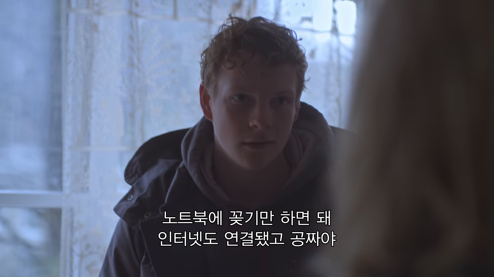
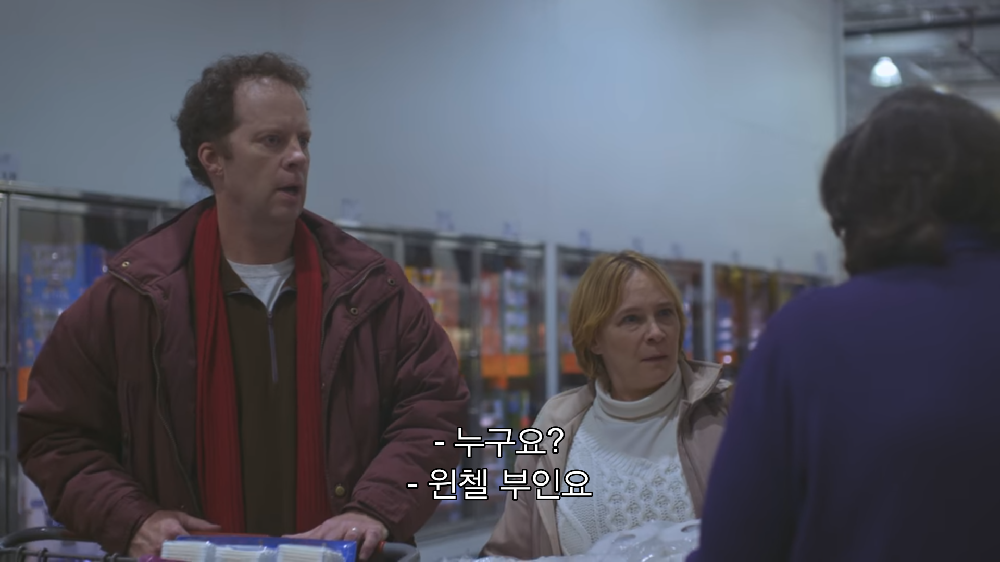
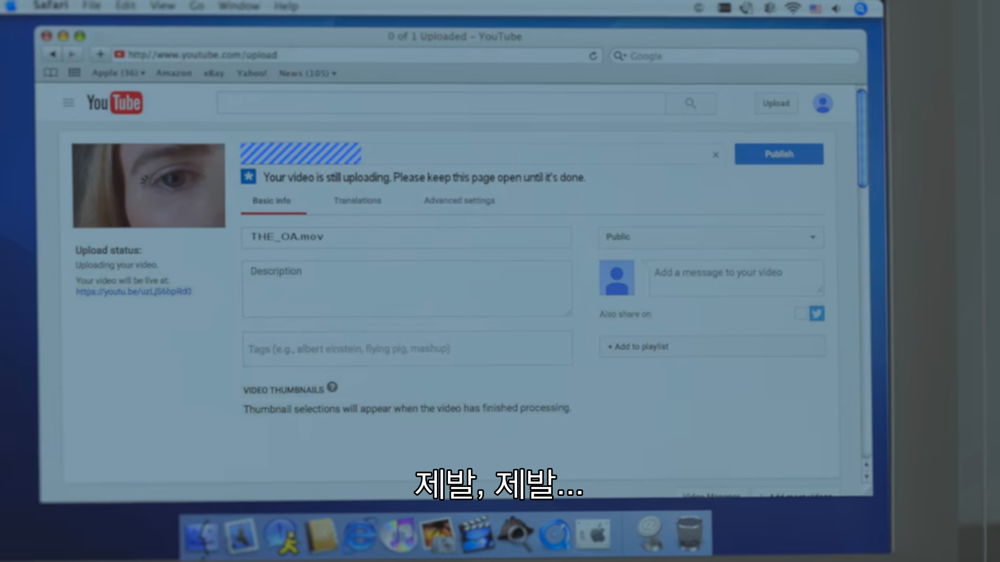
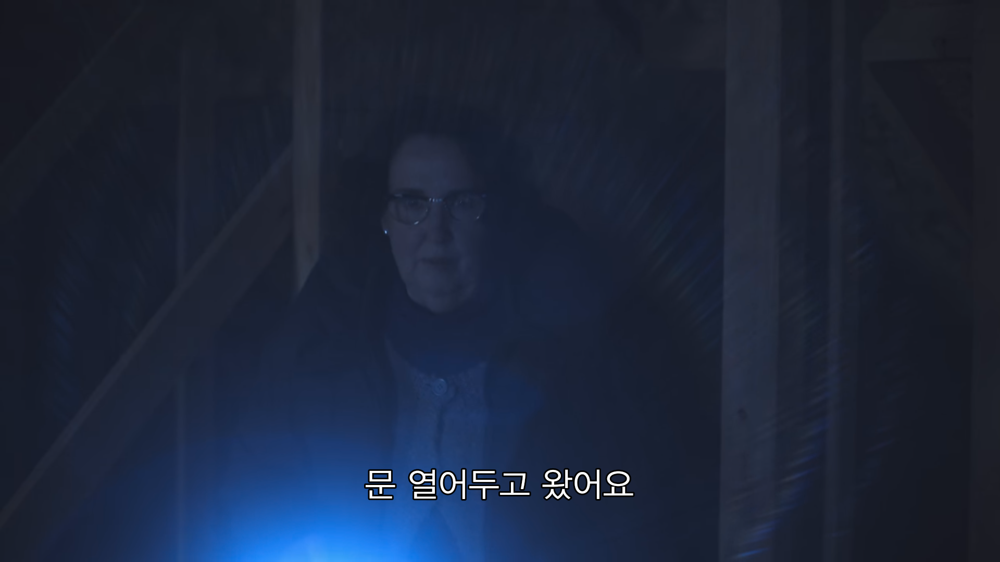
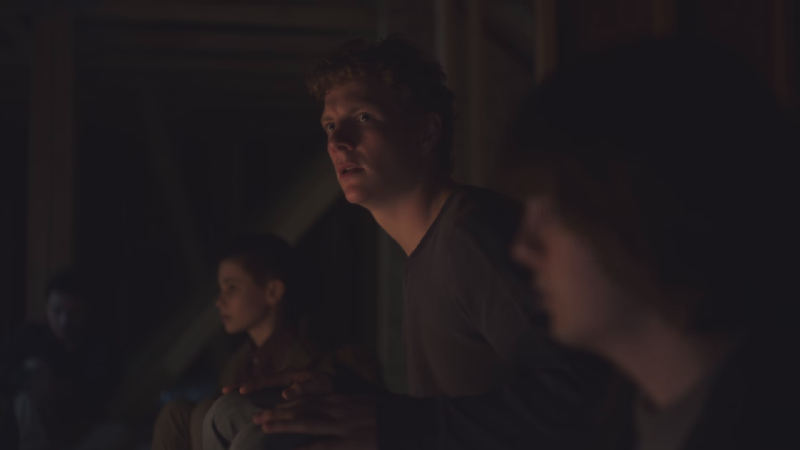

넷플릭스에서 최근 OA라는 TV 시리즈의 두번째 파트를 스트리밍 시작하더군요. 사후 세계를 다루는 드라마라고 듣기만 했지 직접 보지는 않아서 조심스레 1화만 봐볼까? 했는데 어느새 전부 보고있는 저를 발견했습니다. 여운이 전부 가시기 전에 글을 써볼까 합니다.

### 파트1 예고편

<iframe width="560" height="315" src="https://www.youtube.com/embed/DvHJtez2IlY" frameborder="0" allow="accelerometer; autoplay; encrypted-media; gyroscope; picture-in-picture" allowfullscreen></iframe>

 

"7년 동안 행방불명되었던 딸이 돌아온다. 하지만 돌아온 딸은 등의 괴이한 상처와 함께 이상 행동을 하기 시작한다."

사실 예고편과 위의 짧은 설명만 봤을때 구미가 그렇게 당기는 편은 아니었습니다.

넷플릭스에서 사람이 사라지고 이상한 행동을 하는건 흔한일이니까요.👻

그런데 이게 보다보니 내용이 심상치가 않더군요. 간단하게 줄거리를 이야기 해볼까 합니다.

### 짧은 줄거리(약 스포)

*파트1 1화정도의 스포일러만 포함하고 있습니다.

행방불명됬던 주인공 프레이리는, 행방불명이 되기 전부터 이미 눈이 안보이는 맹인이었습니다. 그런데 사라진 이후 7년만에 프레이리가 돌아온겁니다. 그것도 눈이 보이는 채로 말이죠. 보통사람들은 이해할 수 없는 현상입니다. 거기다가 병원에선 자신의 이름을 OA라고 하며 남들이 보기엔 정신병같은 느낌이 들게끔 이상행동을 하죠. 그리고 길러주던 부모님을 만나 다시 집으로 돌아옵니다.

집으로 돌아온 프레이리(OA)는 어렸을때 부턴 데자뷰같은 꿈을 또 꾸면서 코피를 흘리면서 잠을 깨길 반복합니다. 그리고 '호머'라고 하는 사람을 찾으려 하기 시작하죠.

FBI에서 컴퓨터를 쓰지 마라고 해서인지, 부모님은 와이파이 비밀번호를 안알려줍니다.

그래서 밖으로 잠깐 도망쳐 나와 학생들의 마약거래소(?)에 쳐들어가 갑자기 와이파이 비밀번호를 달라며 도움을 청합니다. 그러다 괜한 싸움에 말려들게 되고, 거기서 조차 남들과는 다른 모습을 보여주며 주변 사람들이 뭔가를 느끼게 만듭니다.

그 중 스티브라는 최근 사고를 쳤던 학생이 프레이리의 그런 이상한 점에 끌려서 프레이리의 방에 몰래 들어와 인터넷이 연결된 모바일 라우터를 가지고와 인터넷에 연결해줍니다.

이 소년은 언급했다시피 사고를 자주 쳐서 아버지가 군사학교 비슷한곳에 보내버리려고 이야기가 되있었습니다. 프레이리는 와이파이에 대한 답례로 이 소년의 담임 선생님에게 가서 소년의 엄마 흉내를 내며 담임과 이야기를 하고 아버지가 보내버리려던 군사학교 비슷한곳에 못가게 막아주죠. 그리고 이 이야기를 하던 담임선생님도 프레이리에게 뭔가를 느끼게 됩니다.

그 이후 이 소년의 아버지가 담임선생님을 우연히 마트에서 만나 프레이리에 대해 이야기를 나누면서 소년의 아버지는 스티브의 어머니가 와서 이야기를 하고 갔다는 이야기를 듣죠. 당연히 어이가 없을수밖에 없습니다.

그렇게 스티브의 부모님이 프레이리의 집으로 찾아가 따지고, 일이 어떻게 될지 짐작한 프레이리는 미리 찍어뒀던 동영상을 유튜브에 올립니다.

동영상의 내용은 "도움이 필요해, 난 정의하기 힘든 경계를 넘어야해. 넌 무슨 말인지 알지? 알지 못해도 느낄 수 있을 거야. 너도 다른 경계를 느꼈잖아 청소년기와 성인기의 경계처럼 네 운명을 바꿀 순 없지만 네가 운명을 만나도록 도와줄게. 오늘 밤 자정에 경계로 여행을 떠나자 크레스트우드 뷰 끝의 버려진 집에서. 나올 땐 앞문을 여어두고 와야 해. 날 초대해야 하니까" 였습니다.

버려진 집은 처음에 나왔던 소년들이 사용했던 마약 거래소였죠.

그렇게 동영상을 본 버려진 집에서 만난 소년 4명이 먼저 그 집으로 향해 프레이리를 만납니다. 그리고 자신은 너희들의 도움을 받아 어디로 보내져야 한다며 무조건 5명이 필요하다는 프레이리. 한명이 부족하다고 합니다.

그러자 등장한 선생님.😱

선생님 또한 프레이리(선생님에겐 자신이 OA라고 소개를 했었습니다.)의 말에 무언가 생각이 들어 OA를 구글링하고 그 영상을 봤던거죠.

그렇게 잘 안어울리는 5명이 모이고, 프레이리는 자신의 어린 시절부터, 자신이 사라진때, 그리고 돌아온 지금까지의 이야기를 그들에게 들려줍니다.

본격적으로 OA의 이야기가 시작되는 겁니다.🤔

### 후기

그렇게 들려주는 이야기가 상당히 흥미롭습니다. 조금은 이상하게 느껴질 수도 있을거구요. 그도 그럴게 파트1만 나왔을 때는 사람들이 이게 대체 무슨 드라마냐며 그렇게 호평을 했던 드라마는 아니였습니다.

그런데 파트2가 나오면서 스토리를 이렇게 풀어내나? 하는 사람들이 많아 보이더군요. 진행 될 수록 이야기가 점점 더 흥미진진해진다는 소립니다.

저도 보면 볼수록 뒷 이야기가 궁금해져 계속해서 보게됬고 만족스럽게 봤습니다.  서로 잘 모르던 사람들이 모여서 함께가 되가는 과정이라던지, 그런점에선 또 넷플릭스에서 유명한 '기묘한 이야기'가 생각이 나서 반갑더군요. 아직 안보셨다면, OA도 좋은 선택입니다.👍