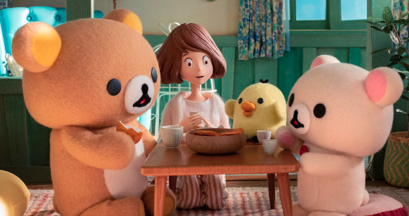

넷플릭스에서 4월에 방영을 시작한 "리락쿠마와 가오루씨"를 보았습니다.

이미 포스터부터 귀여움이 넘쳐흘러 안보고 지나치기가 힘들었습니다.😂

리락쿠마는 어렸을때 아트박스같은 문구점이나 마트에서 인형만 봤지, 따로 책같은걸 따로 본적은 없었습니다.

귀여운 캐릭터라고만 알고 있었죠.

이번 넷플릭스의 리락쿠마와 가오루씨는 독특하게도 스톱모션으로 영상을 만들었습니다. 스톱모션의 대표적인 작품은 월레스와 그로밋이 있었죠?

만드는데도 시간이 상당히 오래 걸린다고 하죠? 그만큼 독특한 느낌을 받을 수 있습니다.

### 👨‍👩‍👧‍👦 등장인물

#### 가오루

주인공이라고 할 수 있는 가오루씨는 사메지마 물산이라는 회사에서 일하는 여성입니다. 인터넷을 돌아보니 매일 전업으로 피곤한 나날들을 보내는 사람으로, 어느날 혼자사는 아파트에서 돌아오니 리락쿠마가 있었다고 합니다.

가오루씨는 만화같은 부분에선 따로 생김새가 표현되지 않고 실루엣으로만 표현이 됐었다는데요, 넷플릭스에서 처음 모습이 등장하는 거라고 합니다.

한 에피소드에선 택배 배달을 해주는 남자가 마음에 들어 매일 만나고 싶어 인터넷에서 쇼핑을 매일 하며 무려 687만원 가량을 쓰는 모습을 보여주는 등, 예상외로 엉성한 모습을 자주 보여줍니다.

#### 리락쿠마

가장 큰 갈색곰입니다. Relax + Kuma(일본어로 곰) 합쳐서 리락쿠마라고 합니다. 이름답게 만사 느긋한 모습을 보여줍니다. 등뒤엔 지퍼가 달려있어서 옷도 갈아입습니다(?) 재밌는 설정이네요.

핫케이크, 경단을 좋아하고 에피소드 상에서도 자주 나옵니다.

#### 코리락쿠마

코(일본어로 작다는 뜻) + 리락쿠마를 합친 이름으로, 말그대로 리락쿠마보단 조금 작은 핑크색 곰입니다. 장난을 좋아한다고 합니다. 역시 등뒤에 지퍼가..

#### 키이로토리

키이로토리는 키이로(일본어로 노란색) + 토리(새)를 합친 이름으로 모습 그대로를 보여주네요. ~~작명 참 쉽다..~~

청소와 저금을 좋아하는 독특한 설정을 가지고 있는데, 에피소드에서 이런 모습이 자주 나옵니다. 가오루가 없는 집안을 청소한다거나, 맹한 행동을 할때 제지하는 등 가장 이성적인 캐릭터이기도 하고 제가 봤을땐 제일 귀엽습니다..🐥

### ✍후기

각 에피소드들은 약 11분정도로 짧지만 재밌으면서 잔잔한 분위기에서 어느정도 힐링을 할 수 있는 이야기들입니다. 에피소드의 마지막엔 이걸 이렇게 연결시키나?😅 하는 짤막한 교훈을 던져주면서 인생을 다시 생각하게 해주며(?) 끝이납니다.

넷플릭스가 일본에서 애니메이션 산업에 돈을 꽤 쓰고있다는 이야기를 들었는데, 독자적인 컨텐츠를 많이 만들고 있다는게 눈에 보이네요. 재밌었습니다. 짬날때 잠깐 보기도 좋네요.