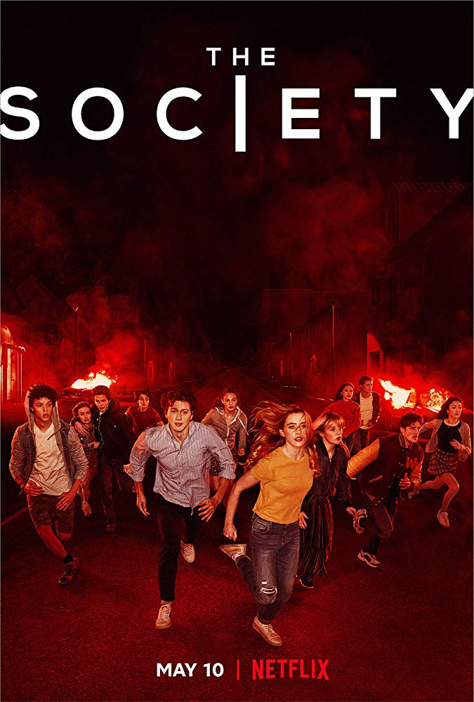

## 더 소사이어티

5월 12일 넷플릭스에서 THE SOCIETY(더 소사이어티)를 스트리밍 했습니다.

> 갑자기 취소된 캠프, 흔적도 없이 사라진 어른들. 웨스트 햄 고등학교 아이들에게 믿을 수 없는 일이 벌어졌다. 분명 집으로 왔는데, 그들이 알던 세상이 아니다. 어째서?

소사이어티는 사회를 의미하죠. 드라마와 어떤 관련이 있을지 궁금하기도 하고, 넷플릭스는 또 이 아이들의 부모님을 어디로 보냈는지 알아봐야 할 것 같았습니다.

### 스토리(약스포)

시즌 1은 총 10화로 이루어져 있습니다. 스토리는 묘사된대로, 웨스트 햄 고등학교를 다니던 학생들은 평범하게 학교를 잘 다니고 있었습니다. 어느날 근처에서 심한 악취가 납니다.😷(이전에도 몇번 이런 경우가 있던 것 같습니다.)

그래서 부모들은 일단 학생들을 해결 될 때까지 몇일동안 캠프를 떠나 보내기로 합니다. 그리고 캠프 당일날 학생들이 모두 버스에 타 캠프를 떠났습니다. 떠나는 동안 날씨가 매우 안좋았었습니다. 비도 많이오고, 천둥도 치고 마치 태풍 같았죠 🌪.

가고 있는 도중에 보니 나무가 쓰러지고 낙석이 생겨 길이 막혀있어서 버스기사들은 돌아간다고 말하고 다시 학교로 돌아갑니다. 그리고 학생들을 학교에 다시 내려다주죠. 그리고 유유히 사라집니다.🚌

그리고서 내린 학생들은 부모님에게 전화를 해보는데, 모든 학생들의 부모님이 전화를 받지 않는겁니다. 몇몇은 집에갔는데도 집엔 부모님이 안계시죠. 뭐, 잠깐 단체로 어디 갔나보다 하는 생각을 하는 다수의 학생들은 학교 교회에서 광란의 파티를 보내고, 아침이 되어 이제 다시 천천히 동네를 둘러보니, 이게 왠걸. 동네에서 나가는 길이 모두 막혀있습니다. 그리고 그 앞으론 끝없는 숲들이 펼쳐져 있죠.

그리고 여기, 이 동네엔 학생들 밖에 없습니다. 앞으로 펼쳐질 이야기가 어느정도 짐작이 가실겁니다.

### 후기

제목에서 말하는데로 더 소사이어티는 이 어린 친구들이 이제 이런 상황에서 어떻게 살아갈 것인지, 하나의 작은 사회의 모습을 보여주는 것 같습니다. 우리 사회에서 일어나는 전반적인 모습들이 많이 보인다고 할 수 있죠. 물론 더 과격하긴 하지만요.

좁은 세계라서 그런지 인물들의 관계도 매우 복잡해 집니다. 다양한 인물상을 많이 가져왔죠.

시즌 1이라서 그럴진 몰라도 남겨진 떡밥이 너무 많아서 아직 뭐라고 판단하기 이른 상태이긴 하지만 나쁘진 않았습니다.

오히려 시즌 2가 뭔가 스케일이 더 커질 것 같기도 하고 기대되긴 합니다.

시즌 2가 몇 년 뒤에나 나올거 같은데.. 너무 일찍 본 감이 없잖아 있군요..😭