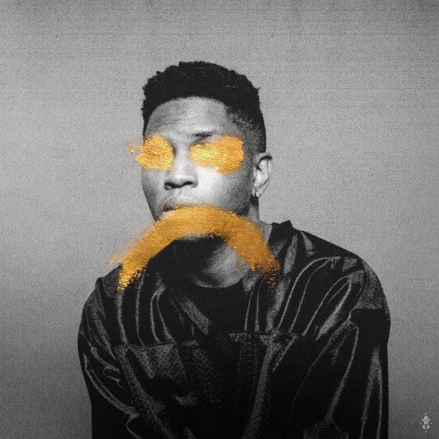

<iframe width="560" height="315" src="https://www.youtube.com/embed/videoseries?list=OLAK5uy_liofByA1t2rSwG4b5qR5NztGoeKi5c62Y" frameborder="0" allow="accelerometer; autoplay; encrypted-media; gyroscope; picture-in-picture" allowfullscreen></iframe>

 

## 트랙리스트

---

| No. |                  타이틀                      |
|:--------:|:---------------------------------------:|
|    1.    |                 "First"                 |
|    2.    |           "Talking to Myself"           |
|    3.    |                "Shotgun"                |
|    4.    |                "Bourbon" 🔥            |
|    5.    |             "Bone + Tissue"             |
|    6.    |              "Oh, Universe"             |
|    7.    |             "Weight in Gold"            |
|    8.    |                "Episode"                |
|    9.    |                "Miyazaki"               |
|    10.   |                "Counting"               |
|    11.   |               "Percogesic"              |
|    12.   |                "Jupiter"                |
|    13.   |                "Open Up"                |
|    14.   | "Skipping Stones" (featuringJhené Aiko) |
|    15.   |                "Chandra"                |
|    16.   |                  "Last"                 |